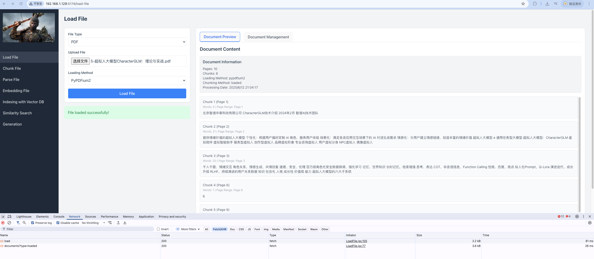
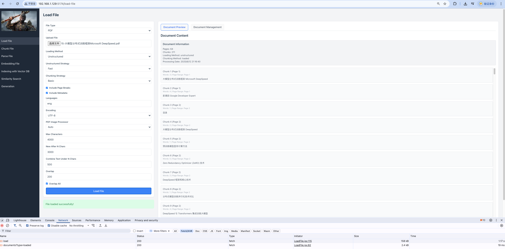

## 开始使用

1. 克隆仓库
2. 安装依赖：
   ```bash
   cd frontend
   nvm use v22.14.0
   npm install
   ```
3. 修改`frontend\src\config\config.js`中的代码环境地址`apiBaseUrl`

```bash
const config = {
              development: {
                apiBaseUrl: 'http://127.0.0.1:8000'
              },
              production: {
                apiBaseUrl: 'http://api.example.com'
              },
              test: {
                apiBaseUrl: 'http://localhost:8001'
              }
            };
```

运行 `npm run dev` 命令来安装项目依赖的前端组件。

4. 后端依赖

```bash
cd backend
conda create -n rag-framework-polish python=3.11
conda activate rag-framework-polish
pip install -r requirements_mac_no_GPU.txt
```

5. 启动后端

上述开发环境安装完成后，使用`uvicorn`启动后端

```shell
# 进入后端代码目录
cd backend/
# 启动
uvicorn main:app --reload --port 8000 --host 127.0.0.1
```

### Load Files
#### New Load Method PyPDFim2


#### More Augments To LOad PDF Files With Unstructured


